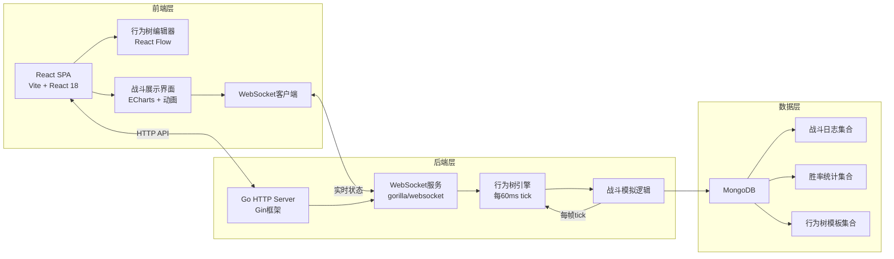
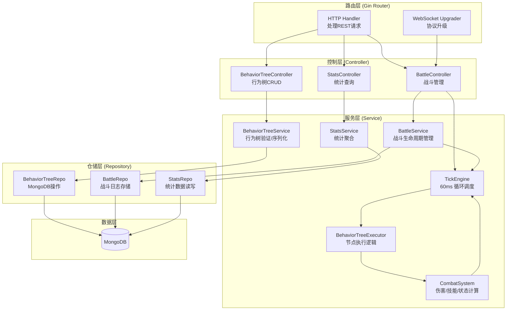
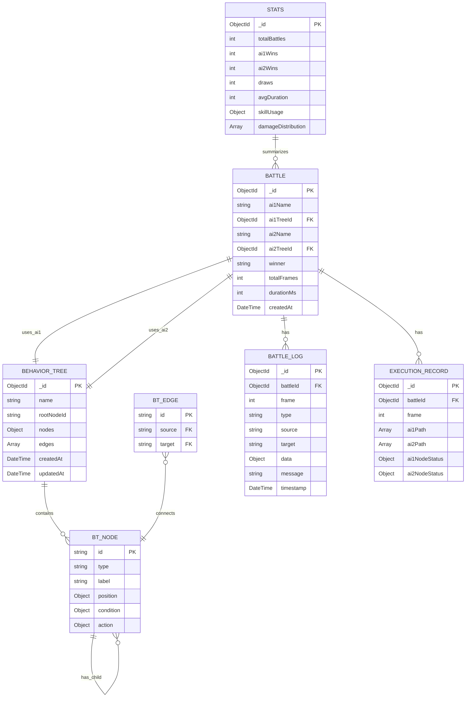

## 1. 架构设计



## 2. 技术描述

- **前端**：React@18 + TypeScript + Vite@5 + React Flow@11 + TailwindCSS@3 + ECharts@5 + Framer Motion
- **初始化工具**：npm create vite@latest
- **状态管理**：Zustand（轻量状态管理）
- **后端**：Go 1.21 + Gin@v1.9 + gorilla/websocket + mongo-go-driver
- **数据库**：MongoDB 6.0+
- **实时通信**：WebSocket（全双工通信，每帧推送战斗状态）
- **行为树格式**：JSON序列化，包含节点类型、子节点、条件参数、动作参数

## 3. 路由定义

| 路由 | 页面/用途 |
|-------|---------|
| / | 首页，项目介绍 + 快速入口 |
| /editor | 行为树编辑器 |
| /battle | 战斗模拟界面 |
| /stats | 战斗统计面板 |

## 4. API 定义

### 4.1 HTTP API

```typescript
// 行为树相关
interface BehaviorTree {
  id: string;
  name: string;
  nodes: Record<string, BTNode>;
  edges: BTEdge[];
  rootNodeId: string;
  createdAt: number;
  updatedAt: number;
}

interface BTNode {
  id: string;
  type: 'selector' | 'sequence' | 'condition' | 'action';
  position: { x: number; y: number };
  data: {
    label: string;
    condition?: {
      type: 'hp_above' | 'hp_below' | 'enemy_hp_above' | 'enemy_hp_below' | 'skill_ready' | 'energy_above' | 'cooldown_ready';
      value: number;
      skillId?: string;
    };
    action?: {
      type: 'attack' | 'skill' | 'defend' | 'heal' | 'wait' | 'charge';
      skillId?: string;
      value?: number;
    };
  };
}

interface BTEdge {
  id: string;
  source: string;
  target: string;
}

// 战斗请求
interface BattleRequest {
  ai1: {
    name: string;
    behaviorTree: Omit<BehaviorTree, 'id' | 'createdAt' | 'updatedAt'>;
  };
  ai2: {
    name: string;
    behaviorTree: Omit<BehaviorTree, 'id' | 'createdAt' | 'updatedAt'>;
  };
  options?: {
    maxFrames?: number;
    frameInterval?: number;
  };
}

// 战斗响应
interface BattleResponse {
  battleId: string;
  status: 'started' | 'ended';
  wsUrl: string;
}

// 战斗状态
interface BattleState {
  frame: number;
  timestamp: number;
  ai1: FighterState;
  ai2: FighterState;
  executionPath: {
    ai1: string[];
    ai2: string[];
  };
  nodeStatus: {
    ai1: Record<string, 'running' | 'success' | 'failure'>;
    ai2: Record<string, 'running' | 'success' | 'failure'>;
  };
  events: BattleEvent[];
  isEnded: boolean;
  winner?: 'ai1' | 'ai2' | 'draw';
}

interface FighterState {
  name: string;
  hp: number;
  maxHp: number;
  energy: number;
  maxEnergy: number;
  skills: SkillState[];
  buffs: Buff[];
}

interface SkillState {
  id: string;
  name: string;
  damage: number;
  cooldown: number;
  currentCooldown: number;
  energyCost: number;
  icon: string;
}

interface Buff {
  id: string;
  name: string;
  duration: number;
  type: 'attack_up' | 'defense_up' | 'stun' | 'poison';
  value: number;
}

interface BattleEvent {
  frame: number;
  timestamp: number;
  type: 'attack' | 'skill' | 'defend' | 'heal' | 'buff' | 'damage' | 'death' | 'node_result';
  source: 'ai1' | 'ai2';
  target: 'ai1' | 'ai2';
  data: Record<string, any>;
  message: string;
}

// 统计数据
interface BattleStats {
  totalBattles: number;
  ai1Wins: number;
  ai2Wins: number;
  draws: number;
  avgDuration: number;
  skillUsage: Record<string, number>;
  damageDistribution: { range: string; count: number }[];
  recentBattles: BattleSummary[];
}

interface BattleSummary {
  id: string;
  ai1Name: string;
  ai2Name: string;
  winner: string;
  duration: number;
  totalFrames: number;
  createdAt: number;
}

// API 端点
// GET /api/behavior-trees - 获取行为树列表
// POST /api/behavior-trees - 保存行为树
// GET /api/behavior-trees/:id - 获取单个行为树
// PUT /api/behavior-trees/:id - 更新行为树
// DELETE /api/behavior-trees/:id - 删除行为树
// POST /api/battles - 发起战斗
// GET /api/battles/:id - 获取战斗详情
// GET /api/battles/:id/logs - 获取战斗日志
// GET /api/stats - 获取统计数据
```

### 4.2 WebSocket 消息

```typescript
// 客户端发送
interface WSMessage {
  type: 'subscribe' | 'unsubscribe' | 'command';
  battleId: string;
  data?: any;
}

// 服务端推送
interface WSPush {
  type: 'state_update' | 'battle_end' | 'error';
  battleId: string;
  data: BattleState;
}
```

## 5. 服务器架构图



## 6. 数据模型

### 6.1 ER图



### 6.2 MongoDB 索引

```javascript
// behavior_trees 集合
db.behavior_trees.createIndex({ name: 1 });
db.behavior_trees.createIndex({ createdAt: -1 });

// battles 集合
db.battles.createIndex({ createdAt: -1 });
db.battles.createIndex({ winner: 1 });
db.battles.createIndex({ ai1TreeId: 1, ai2TreeId: 1 });

// battle_logs 集合
db.battle_logs.createIndex({ battleId: 1, frame: 1 });
db.battle_logs.createIndex({ type: 1 });
db.battle_logs.createIndex({ timestamp: -1 });

// execution_records 集合
db.execution_records.createIndex({ battleId: 1, frame: 1 });

// stats 集合
db.stats.createIndex({ _id: 1 });
```

### 6.3 行为树 JSON 格式示例

```json
{
  "name": "战士AI",
  "rootNodeId": "root",
  "nodes": {
    "root": {
      "id": "root",
      "type": "selector",
      "position": { "x": 400, "y": 100 },
      "data": { "label": "选择器" }
    },
    "low_hp_heal": {
      "id": "low_hp_heal",
      "type": "sequence",
      "position": { "x": 250, "y": 250 },
      "data": { "label": "低血量治疗" }
    },
    "hp_check": {
      "id": "hp_check",
      "type": "condition",
      "position": { "x": 150, "y": 400 },
      "data": {
        "label": "血量<30%",
        "condition": {
          "type": "hp_below",
          "value": 30
        }
      }
    },
    "heal_action": {
      "id": "heal_action",
      "type": "action",
      "position": { "x": 350, "y": 400 },
      "data": {
        "label": "使用治疗",
        "action": {
          "type": "heal",
          "value": 50
        }
      }
    },
    "attack_sequence": {
      "id": "attack_sequence",
      "type": "sequence",
      "position": { "x": 550, "y": 250 },
      "data": { "label": "攻击序列" }
    },
    "skill_ready": {
      "id": "skill_ready",
      "type": "condition",
      "position": { "x": 450, "y": 400 },
      "data": {
        "label": "技能就绪",
        "condition": {
          "type": "skill_ready",
          "skillId": "fireball"
        }
      }
    },
    "fireball_action": {
      "id": "fireball_action",
      "type": "action",
      "position": { "x": 650, "y": 400 },
      "data": {
        "label": "释放火球",
        "action": {
          "type": "skill",
          "skillId": "fireball"
        }
      }
    },
    "default_attack": {
      "id": "default_attack",
      "type": "action",
      "position": { "x": 750, "y": 250 },
      "data": {
        "label": "普通攻击",
        "action": {
          "type": "attack",
          "value": 10
        }
      }
    }
  },
  "edges": [
    { "id": "e1", "source": "root", "target": "low_hp_heal" },
    { "id": "e2", "source": "root", "target": "attack_sequence" },
    { "id": "e3", "source": "root", "target": "default_attack" },
    { "id": "e4", "source": "low_hp_heal", "target": "hp_check" },
    { "id": "e5", "source": "low_hp_heal", "target": "heal_action" },
    { "id": "e6", "source": "attack_sequence", "target": "skill_ready" },
    { "id": "e7", "source": "attack_sequence", "target": "fireball_action" }
  ]
}
```
