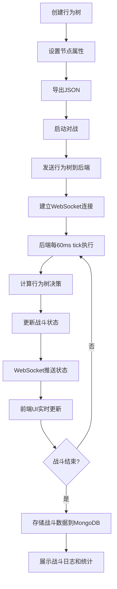

## 1. 产品概述

行为树AI对战平台，允许用户通过可视化编辑器创建AI行为树，两个AI通过WebSocket进行实时战斗模拟。后端Go服务每60ms执行行为树tick，驱动战斗逻辑。战斗数据实时同步到前端，展示执行路径高亮、血条变化和技能冷却状态。

- 主要用途：AI行为树可视化编辑、AI对战模拟、战斗数据分析
- 目标用户：游戏开发者、AI爱好者、行为树研究人员
- 产品价值：降低行为树开发门槛，可视化调试AI决策过程，提供量化的战斗性能分析

## 2. 核心功能

### 2.1 用户角色
| 角色 | 注册方式 | 核心权限 |
|------|----------|----------|
| 普通用户 | 无需注册 | 创建行为树、发起对战、查看战斗日志和统计 |

### 2.2 功能模块
1. **行为树编辑器**：可视化拖拽编辑，支持Selector/Sequence/Condition/Action四种节点
2. **战斗模拟界面**：实时展示双A血条、技能冷却、行为树执行路径高亮
3. **战斗日志**：记录每帧战斗事件，支持回溯查看
4. **统计面板**：展示胜率统计、平均战斗时长、技能使用率等数据

### 2.3 页面详情
| 页面名称 | 模块名称 | 功能描述 |
|-----------|-------------|---------------------|
| 编辑器页面 | 节点面板 | 拖拽添加四种行为树节点到画布 |
| 编辑器页面 | 画布区域 | 可视化编辑行为树结构，连接节点，设置节点属性 |
| 编辑器页面 | 工具栏 | 保存、加载、清空、导出JSON、启动对战 |
| 战斗页面 | 状态面板 | 双方AI血条、能量条、技能冷却展示 |
| 战斗页面 | 行为树视图 | 实时高亮当前执行路径，显示节点状态（运行中/成功/失败） |
| 战斗页面 | 战斗日志 | 滚动显示实时战斗事件，可暂停/继续 |
| 统计页面 | 胜率统计 | 饼图展示双方胜率，柱状图展示历史对战结果 |
| 统计页面 | 详细数据 | 平均战斗时长、技能使用率、伤害分布等 |

## 3. 核心流程

用户在编辑器中拖拽创建行为树结构，设置Condition条件和Action技能参数，导出为JSON格式。启动对战后，前端将两个AI的行为树JSON发送到后端，后端建立WebSocket连接开始战斗模拟。后端每60ms执行一次tick，计算双方AI行为树决策，更新战斗状态，通过WebSocket推送至前端。前端实时更新UI，高亮行为树执行路径，更新血条和技能冷却。战斗结束后，结果存入MongoDB，用户可查看详细战斗日志和统计数据。

## 4. 用户界面设计

### 4.1 设计风格
- **设计基调**：赛博朋克/科技感，深色主题，霓虹高亮
- **主色调**：深海军蓝 #0a0e17，霓虹青 #00f5d4，霓虹紫 #9d4edd，警示红 #ff006e
- **辅助色**：成功绿 #39ff14，警告黄 #ffbe0b，信息蓝 #00bbf9
- **字体**：JetBrains Mono（代码/数据）+ Orbitron（标题/数字）
- **按钮风格**：霓虹边框，悬停发光效果，方形带切角
- **布局风格**：模块化卡片布局，网格对齐，科技感边框装饰
- **图标风格**：线性图标，霓虹描边，状态变化时有脉冲动画

### 4.2 页面设计概述
| 页面名称 | 模块名称 | UI Elements |
|-----------|-------------|-------------|
| 编辑器页面 | 节点面板 | 左侧垂直面板，四种节点卡片，拖拽时缩放动画 |
| 编辑器页面 | 画布区域 | 深色网格背景，节点圆角矩形，连接线贝塞尔曲线，选中高亮发光 |
| 编辑器页面 | 属性面板 | 右侧面板，动态表单，Condition下拉选择，Action参数输入 |
| 战斗页面 | 状态面板 | 顶部对称布局，双方血条带数字显示，技能图标带冷却遮罩 |
| 战斗页面 | 行为树视图 | 左右分栏显示两个AI行为树，执行节点绿色脉冲边框，路径高亮连线 |
| 战斗页面 | 战斗日志 | 底部滚动区域，时间轴样式，不同事件类型不同颜色标记 |
| 统计页面 | 图表区域 | ECharts图表，霓虹配色，动画过渡效果 |
| 统计页面 | 数据卡片 | 玻璃态效果，渐变边框，大数字展示 |

### 4.3 响应式
- 桌面端优先设计，最小支持1280px宽度
- 行为树编辑器左右面板可折叠，适配小屏幕
- 战斗页面在窄屏时自动切换为上下布局
- 触控设备支持双指缩放画布，长按拖拽节点

### 4.4 动画与交互
- 节点拖拽：带物理惯性的平滑移动
- 执行高亮：节点成功时绿色脉冲扩散，失败时红色闪烁
- 血条变化：数字滚动动画，血条渐变过渡
- 技能冷却：圆形进度条，倒计时数字
- 页面切换：左右滑动过渡，淡入淡出效果
- 连接创建：从源节点拖拽时显示虚线预览，释放后实线动画
